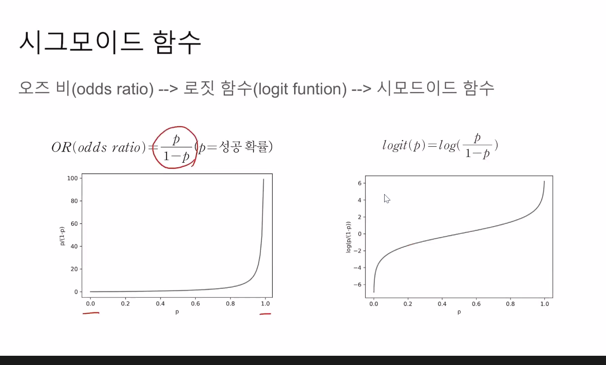

# (딥러닝)로지스틱회귀

### **이진분류란?**

예측값과 실제값(정답)이 두개의 범주로 분류되는 것. 두 범주는 참(True, 1)과 거짓(False, 0)으로 나뉜다. 참을 양성클래스 , 거짓을 음성클래스라고도 부른다.

### **로지스틱 회귀란?**

이진 분류로 나타나 있는 문제를 풀기 위한 대표적인 알고리즘.

실제값 y가 0 또는 1 두 가지 값만 가진 경우, 예측값이 0과 1사이의 값을 가지도록 해야한다. x와 y의 관계를 표현하는 회귀식이 직선을 표현하는  함수가 아니라 s자 형태로 표현할 수 있는  함수가 필요하다.

0과 1사이의 값을 가지면서, s자 형태로 그려지는 함수가 시그모이드 함수.

로지스틱 회귀에서는 데이터가 특정 범주에 속할 확률을 예측하기 위해 아래에 단계를 거침.

1. 모든 속성들의 계수와 절편을 0 으로 초기화 한다.
2. 각 속성들의 값에 계수를 곱해서 log-odds를 구한다.
3. log-odds를 시그모이드 함수에 넣어서 [0, 1] 범위의 확률을 구한다.

- **log-odds(로짓함수)**

선형 회귀에서는 각각의 특성 값에다 가중치를 곱하고 절편을 더해서 예측값을 구하기 때문에 예측값의 범위가 -∞ ~ ∞이다. 이진 분류는 예측값의 범위가 0과 1사이의 값이어야 하기 때문에 log-odds를 구하여 시그모이드 함수에 넣어 범위를 0~1사이로 압축시켜야 한다.

log-odds를 구하기 위해서는 odds 값을 구해야 한다.




odds 값은 성공 확률을 성공하지 않을 확률로 나눈 것이다. odds 값에 log를 씌우면 log-odds가 된다.

- **시그모이드 함수**


- **로지스틱회귀의 진행 단계**


범위가 -∞ ~ ∞인 z를 활성화 함수 중의 하나인 시그모이드 함수를 이용해 범위가 0 ~ 1인 a로 압축하고 임계 함수를 이용해 0 또는 1 값을 가지는 ŷ으로 이진 분류한다.

여기서 $z = b+\sum\limits_{i=1}^nw_ix_i$이다. 

**로지스틱 뉴런 구현하기**

```python
class LogisticNeuron:
    
    def __init__(self): # 가중치(w), 절편(b) None으로 지정
        self.w = None
        self.b = None
        
    def forpass(self, x): # 정방향 계산, 직선방정식 계산
        z = np.sum(x * self.w) + self.b
        return z
    
    def backprop(self, x, err): # 역방향 계산
        w_grad = x * err
        b_grad = 1 * err
        return w_grad, b_grad
    
    def fit(self, x, y, epochs=100): # 훈련함수
        self.w = np.ones(x.shape[1])
        self.b = 0
        for i in range(epochs):      # epochs만큼 훈련반복
            for x_i, y_i in zip(x,y):
                z = self.forpass(x_i)
                a = self.activation(z)
                err = -(y_i - a)     # 오차 계산 *손실 함수의 미분한 결과와 동일하게 하기 위해 '-'붙힘
                w_grad, b_grad = self.backprop(x_i, err)
                self.w -= w_grad     # 가중치 업데이트 
                self.b -= b_grad     # 절편 업데이트
                
    def activation(self, z):      # 활성화 함수
        a = 1 / (1 + np.exp(-z))  # 시그모이드 계산
        return a
    
    def predict(self, x):   # y_hat 계산함수
        z = [self.forpass(x_i) for x_i in x]
        a = self.activation(np.array(z))
        return a > 0.5
```

### 로지스틱 손실함수

분류 문제의 목표는 확률의 정확도가 높도록 하는 것이다. 로지스틱 회귀가 문제에 대한 확률을 제대로 예측하는지 구해 놓은 특성에 가중치와 절편이 적절한지 확인하기 위해 손실을 고려해야 한다. 즉, 로지스틱 회귀 모델의 목표는 로지스틱 함수를 구성하는 계수와 절편에 대해 손실을 최소화하는 값을 찾는 것이다.  

로지스틱 분류문제는 이진분류를 하기 때문에 손실을 두가지 경우로 나누어 생각해보아야 한다. 경사하강법(Gradient Descent)을 사용하여 모든 데이터에서 손실(Log Loss)이 최소화하는 가중치와 절편를 찾을 수 있다.


분류(레이블)가 y=1, y=0 일 때 각각의 손실 함수의 그래프 (h=a)

$L = -(ylog(a) + (1-y)log(1-a))$

 # y: 타깃값(결과값), a: 활성화함수(시그모이드 함수)의 출력값

[로지스틱손실함수](https://www.notion.so/bfa3bb24e68e4f8fb9545398a02a2445)

분류의 정확도는 미분 가능한 함수가 아니기 때문에 이진 크로스 엔트로피 또는 로지스틱 손실 함수를 사용해 경사하강법에 적용하도록 해보자. 


선형회귀의 손실함수를 미분한 것과 로지스틱 손실함수를 미분한 것이 흡사하다. 

### 단일층신경망


신경망은 입력층 은닉층 출력층으로 나눌 수 있다. 은닉층이 하나 이상 존재하면 그 신경망을 딥러닝, 심층신경망이라 부른다.

은닉층이 없이 입력층, 출력층만 존재할 경우 단일층 신경망이라 부른다. 단일층 신경망을 로지스틱회귀라 보아도 무방하다. 


**입력층 구현**

입력층은 입력 데이터 세트 준비하는 것으로 구현가능하다.

```python
from sklearn.datasets import load_breast_cancer
cancer = load_breast_cancer()
print(cancer.data.shape, cancer.target.shape)
```

- 입력층에서 준비한 입력데이터를 훈련데이터와 테스트 데이터로 분류합니다.
    - 훈련 데이터 세트를 나눌 때는 테스트 세트보다 훈련 세트가 더 많아야 합니다.
    - 훈련 데이터 세트를 나누기 전에 양성, 음성 클래스가 훈련 세트나 테스트 세트의 어느 한쪽에 몰리지 않도록 골고루 섞어야 합니다. (훈련세트, 테스트세트 모두 같은 비율로 섞여 있도록 하는 것이 좋다)


**Train set와 Test set 나누기**

```python
from sklearn.model_selection import train_test_split
x_train, x_test, y_train, y_test = train_test_split(x, y, stratify=y, test_size=0.2, random_state=42)
```


- 확률적 경사 하강법 : 무작위성을 주기 위해 각 에포크마다 1개의 샘플을 무작위로 선택, 에포크마다 샘플을 무작위로 섞음  > 빠르게 최적의 가중치로 다가갈 수 있음, 계산양이 적음 >> 최적의 가중치를 찾아가는 궤적이 좋지는 않다.
- 배치 경사 하강법 : 전체 샘플을 한 번에 적용하여 사용. 에포크마다 그레디언트를 한번에 계산하여 가중치를 업데이트 > 가장 좋은 최적의 가중치의 수렴을 보여준다. 가중치의 변하는 궤적이 부드럽게 옳바른 방향으로 흐름 >> 많은 양의 데이터를 적용시킬 때 사용하긴 적절치 않다.
- 미니 배치 경사 하강법 : 두 경사하강법의 절충안. 전체 훈련 데이터 세트에서 n개의 샘플을 무작위로 선택하여 그레디언트 계산 x 반복.

**단일층 신경망 구현**

- 로지스틱 손실 함수와 확률적 경사하강법을 적용해 로지스틱 뉴런 클래스를 업데이트 시킨다.
- 여기서 로지스틱 손실함수는 에포크가 반복됨에 따라 손실함수 값이 감소하는지 지켜보기 위해  losses 리스트에 그 값을 저장해 확인한다.

```python
class SingleLayer:
    
    def __init__(self):
        self.w = None
        self.b = None
        self.losses = [] 
        
    def forpass(self, x): 
        z = np.sum(x * self.w) + self.b
        return z
    
    def backprop(self, x, err): 
        w_grad = x * err
        b_grad = 1 * err
        return w_grad, b_grad
    
    def fit(self, x, y, epochs=100): 
        self.w = np.ones(x.shape[1])
        self.b = 0
        for i in range(epochs):
            loss = 0
            indexes = np.random.permutation(np.arange(len(x))) # 확률적 경사하강법을 사용
            for i in indexes:
                z = self.forpass(x[i])
                a = self.activation(z)
                err = -(y[i] - a)     
                w_grad, b_grad = self.backprop(x[i], err)
                self.w -= w_grad      
                self.b -= b_grad
                a = np.clip(a, 1e-10, 1-1e-10)  # 안전한 로그계산을 위해 두 매개변수의 값을 벗어나는 a는 잘라낸다.
                loss += -(y[i]*np.log(a)+(1-y[i])*np.log(1-a))  #손실함수
            self.losses.append(loss/len(y)) # 손실함수의 결과값이 epochs가 반복됨에 따라서 줄어들고 있는지 확인하기 위함.
                
    def activation(self, z):      
        a = 1 / (1 + np.exp(-z)) 
        return a
    
    def predict(self, x):   # y_hat 계산함수
        z = [self.forpass(x_i) for x_i in x]
        a = self.activation(np.array(z))
        return a > 0.5
       #return np.array(z) > 0 // 효율성을 위해 activation함수 계산 없이 사용 가능.
    
    def score(self, x, y):
        return np.mean(self.predict(x) == y)
```

**신경망 훈련 및 결과 확인**

- fit 함수를 사용해 신경망을 훈련시키고 predict 함수를 통해 예측값을 도출한다. 도출된 예측값과 실제값의 정확도(훈련에 대한 결과)를 score를 사용해 확인한다.

```python
layer = SingleLayer()
layer.fit(x_train, y_train)
layer.score(x_test, y_test)
```
